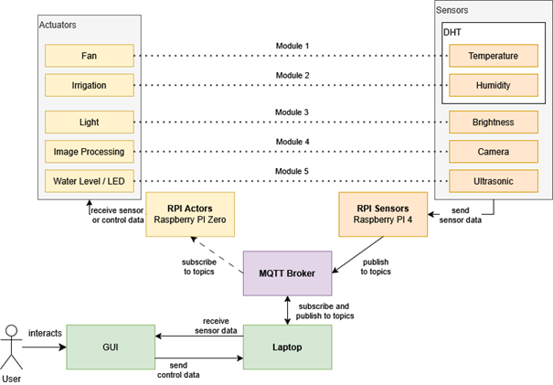

# Smart Greenhouse

As part of the exercise class _“Embedded Systems and Pervasive Systems”_ , we developed a project titled **“Smart Greenhouse”** . The Smart Greenhouse project aims to automate and monitor plant growth conditions within a small-scale greenhouse environment. The system will collect data from multiple sensors and perform automated actions to optimize growing conditions. Additionally, users can access the greenhouse through a web-based GUI to view real-time data and control specific actors directly from the interface. The project consists of 5 modules which are explained in detail in _Full description of system components_:

- **Temperature & Air Control**
- **Humidity & Irrigation**
- **Light Monitoring & Lighting**
- **Image Capturing & Display (Machine Learning) Output**
- **Water level monitoring**



## Prerequisites

- Python 3.9+
- Node.js 16+ & npm
- An MQTT broker on your network (e.g. Mosquitto)

## Get started

This section will explain how to install and use the `Smart Greenhouse` Project, including all sensor-actuator pairs and the GUI.

- First, clone the GitHub Repository

```
git clone https://github.com/moysti/cannabis-zucht.git
```

### Setup MQTT Broker

- In each sensor/actuator script (sensors/ _.py and actuators/_ .py), update:

```python
MQTT_BROKER = "YOUR_BROKER_IP"
```

- In the GUI backend (gui/backend/app.js), update:

```javascript
const client = mqtt.connect("mqtt://YOUR_BROKER_IP:1883");
```

### Sensors / Actuators

**Sensors** and **Actuators** can be found under the their correcsponding folders. Both has been implemented in python. The dependcies are stored in `myenv` environment.

1. Open the environment with `source myenv/bin/activate`
2. Run the wished file, e.g. for the light sensor run `python sensors/sensor_light.py`

### GUI

1. First thing you need to change the IP adress for your MQTT Broker aswell. This can be found under `gui/backend/app.js`. Here you need to change the first line with the actual MQTT Broker IP adress:

```js
const client = mqtt.connect("mqtt://*BROKER_IP*:1883");
```

2. Open your terminal and run following commands:

```bash
cd gui
npm install
// start frontend
npm run dev
// start backend
npm start
```

3. After everything has started, you can access the GUI on `http://localhost:5173`
